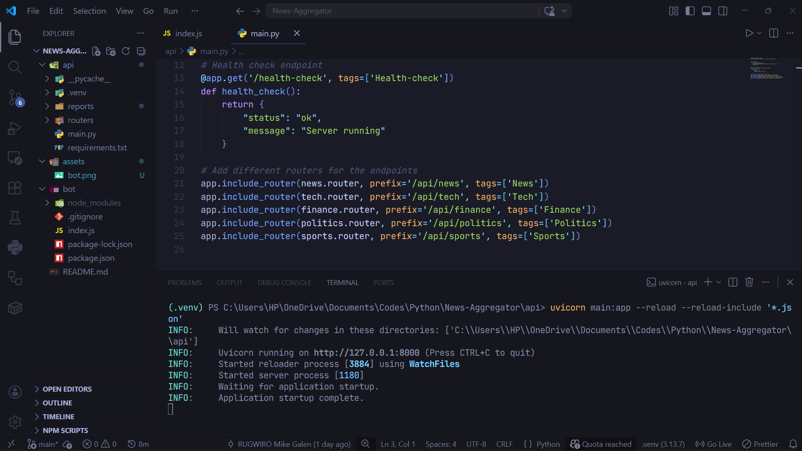
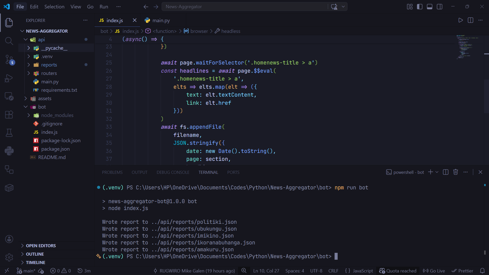
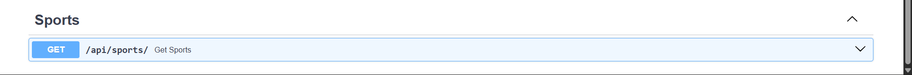
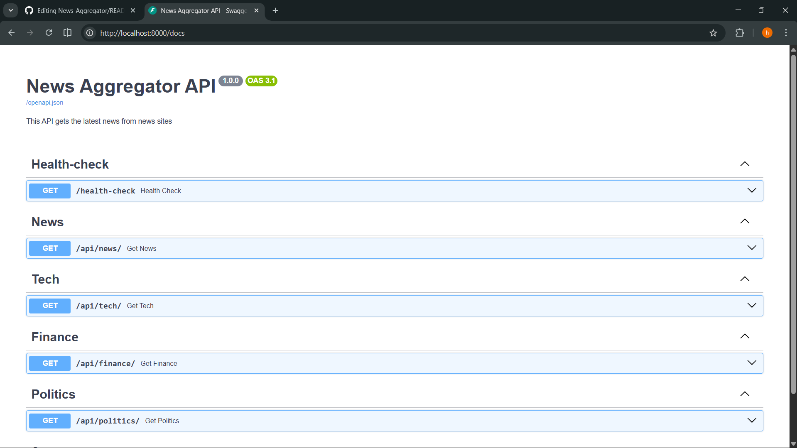
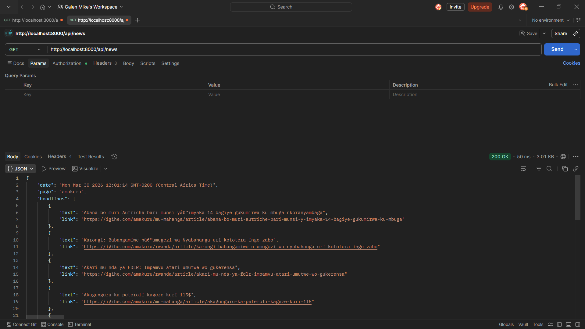
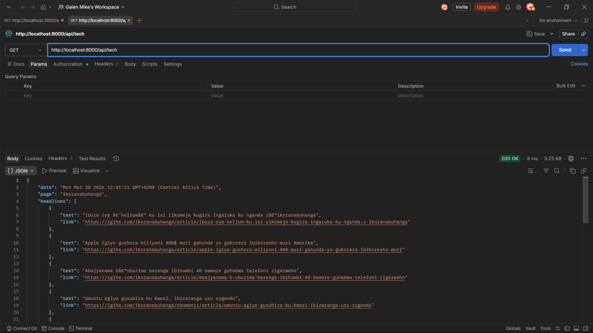

# 📰 Smart News Aggregator API

A lightweight data pipeline that scrapes the latest news from Rwanda's top outlets and serves it through a clean REST API — categorized by topic, ready to consume.

---

## How It Works

```
[Puppeteer Bot]  →  scrapes headlines & links from sites like igihe.com
      ↓
 [JSON Storage]  →  stores structured article data locally
      ↓
  [FastAPI App]  →  serves news by category via REST endpoints
```

---

## Getting Started

### 1. Clone the repository

```bash
git clone https://github.com/mgalen007/News-Aggregator
cd News-Aggregator
```

### 2. Install API dependencies

```bash
cd api
pip3 install -r requirements.txt
```

### 3. Install bot dependencies

```bash
cd ../bot
npm install
```

### 4. Run the scraper bot

```bash
# from /bot
npm run bot
# or
node index.js
```

### 5. Start the API server

```bash
cd ../api
uvicorn main:app --reload
# or
fastapi dev main.py
```

The API will be available at **http://localhost:8000**

---

## Endpoints

| Method | Endpoint | Description |
|--------|----------|-------------|
| `GET` | `/docs` | Interactive Swagger UI documentation |
| `GET` | `/api/news` | General news from Rwanda |
| `GET` | `/api/politics` | Rwandan politics & related coverage |
| `GET` | `/api/sports` | Sports news from Rwanda |
| `GET` | `/api/finance` | Finance & economy news |
| `GET` | `/api/tech` | Tech news (local & global) |

---

## Screenshots

### API server running (FastAPI + Uvicorn)


### Scraper bot running (Puppeteer)


### Swagger UI — endpoint overview


<div align="center">
  
</div>

### Live API responses (Postman)

<div align="center">
  
  &nbsp;
  
</div>

---

## Screenshots

### Swagger UI — available endpoints

<div align="center">
  
  
</div>

### Bot scraping headlines and writing JSON reports


### API server running in VS Code


### Sample responses via Postman

<div align="center">
  
  
</div>

---

## Roadmap

- [ ] **PostgreSQL integration** — replace JSON file storage with a proper database
- [ ] **Scheduled scraping** — use `node-cron` and `APScheduler` to run the bot automatically, no manual triggers needed
- [ ] **Email subscriptions** — let users subscribe and receive news digests via `fastapi-mail` or `smtplib`
- [ ] **AI summarization** — plug an LLM into the pipeline to generate article summaries and enable a personalized reading experience

---

## Tech Stack

- **Scraper**: Node.js + Puppeteer
- **API**: Python + FastAPI
- **Docs**: Swagger UI (auto-generated at `/docs`)

---

## Contributing

Pull requests are welcome. For major changes, please open an issue first to discuss what you'd like to change.